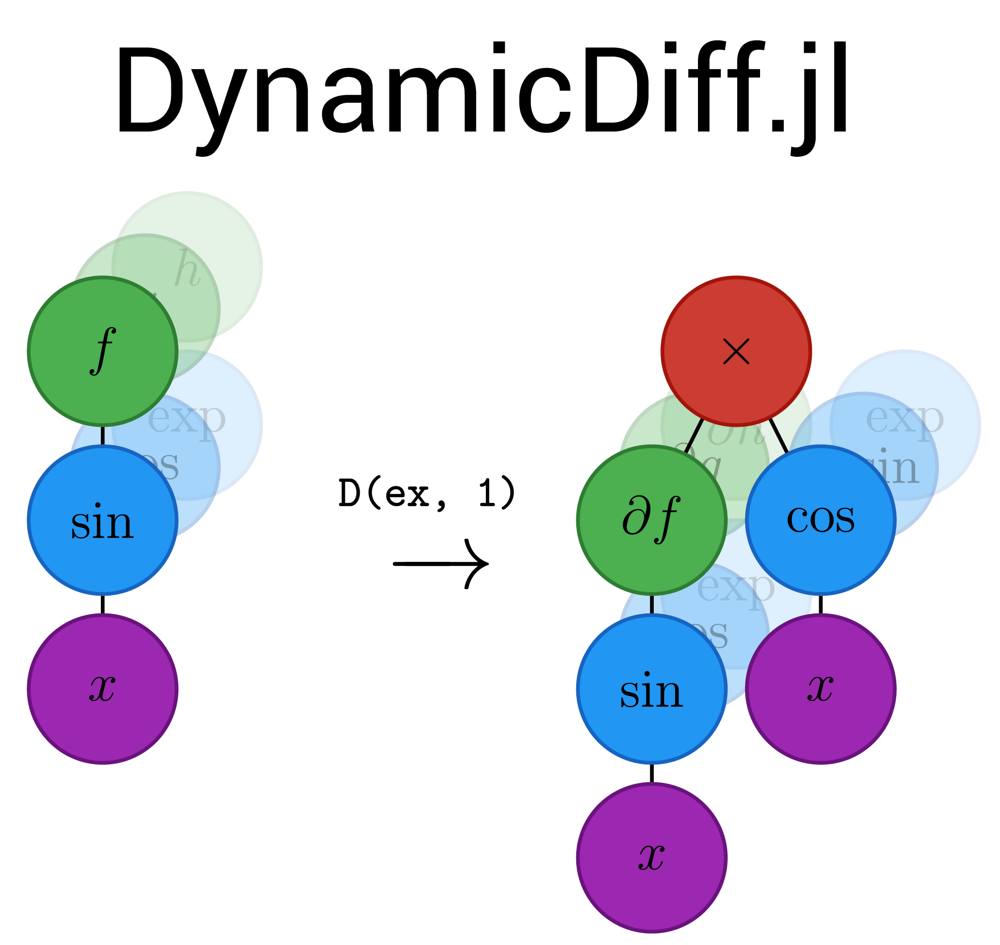

<div align="center">



[](https://ai.damtp.cam.ac.uk/dynamicdiff/dev/) [](https://github.com/MilesCranmer/DynamicDiff.jl/actions/workflows/CI.yml?query=branch%3Amain) [](https://coveralls.io/github/MilesCranmer/DynamicDiff.jl?branch=main)

[](https://github.com/MilesCranmer/DispatchDoctor.jl) [](https://github.com/JuliaTesting/Aqua.jl)

DynamicDiff.jl provides compilation-free symbolic differentiation for runtime-generated expressions.

Built for [SymbolicRegression.jl](https://github.com/MilesCranmer/SymbolicRegression.jl), it is also a generic library for computing derivatives.

</div>

## The Derivative Operator, `D`

This operator computes symbolic partial derivatives of any `AbstractExpression` object (from [DynamicExpressions.jl](https://github.com/SymbolicML/DynamicExpressions.jl)).

```julia
D(ex::AbstractExpression, feature::Integer)
```

This works by extending the `OperatorEnum` contained within `ex` to include the additional derivative operators (one-time compilation for a given set of operators), and then manipulating the symbolic tree to reference the new operators and compute chain rule compositions.

Evaluation then can simply call the result with standard [DynamicExpressions.jl](https://github.com/SymbolicML/DynamicExpressions.jl) syntax, which uses the fast `DynamicExpressions.eval_tree_array` function.

This operator can be nested an arbitrary number of times.

## Performance

Let's see an example.

First, let's set up some variables with a given set of operators:

```julia
using DynamicDiff, DynamicExpressions

operators = OperatorEnum(; binary_operators=(+, *, /, -), unary_operators=(sin, cos));
variable_names = ["x1", "x2", "x3"];
x1, x2, x3 = (Expression(Node{Float64}(feature=i); operators, variable_names) for i in 1:3);
```

Now, we can generate some symbolic functions and take derivatives:

```julia
julia> f = x1 * sin(x2 - 0.5)
x1 * sin(x2 - 0.5)

julia> D(f, 1)
sin(x2 - 0.5)

julia> D(f, 2)
x1 * cos(x2 - 0.5)
```

These symbolic derivatives are done by simply incrementing integers
and arranging a binary tree, so this process is _very_ fast:

```julia
julia> using BenchmarkTools

julia> @btime D($f, 2);
  52.865 ns (5 allocations: 240 bytes)
```

This isn't compiled or cached!
To show this, let's randomly generate arbitrary expressions and then take derivatives of them:

```julia
julia> @btime D(g, 1) setup=(g = [x1, x2, x3][rand(1:3)] * sin([x1, x2, x3][rand(1:3)] - randn())) evals=100
  60.270 ns (2 allocations: 80 bytes)
```

These expressions can then be evaluated using [DynamicExpressions.jl](https://github.com/SymbolicML/DynamicExpressions.jl):

```julia
julia> df = D(f, 1);

julia> df([1.0 2.0]')
1-element Vector{Float64}:
 0.9974949866040544
```

This is also very fast. Let's take the symbolic
derivative of an expression and then evaluate it on 32 batches:

```julia
julia> @btime D($f, 1)(x) setup=(x = randn(2, 32));
  187.132 ns (4 allocations: 416 bytes)
```
